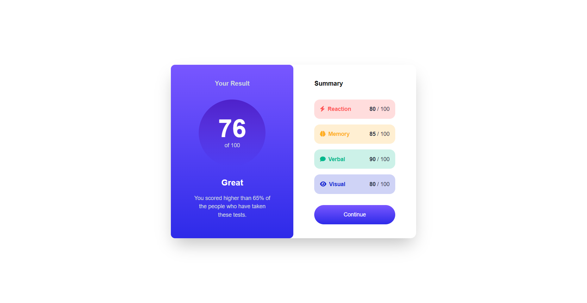

# Frontend Mentor - Results summary component solution

This is a solution to the [Results summary component challenge on Frontend Mentor](https://www.frontendmentor.io/challenges/results-summary-component-CE_K6s0maV). Frontend Mentor challenges help you improve your coding skills by building realistic projects.

## Table of contents

- [Overview](#overview)
  - [The challenge](#the-challenge)
  - [Screenshot](#screenshot)
  - [Links](#links)
- [Built with](#built-with)
- [Author](#author)

## Overview

### The challenge

Users should be able to:

- View the optimal layout for the interface depending on their device's screen size
- See hover and focus states for all interactive elements on the page
- **Bonus**: Use the local JSON data to dynamically populate the content

### Screenshot

### Links

- Solution URL: [Add solution URL here](https://github.com/tiedsandi/summary-card-Fe_challange)
- Live Site URL: [Add live site URL here](https://sandi-fe-summary-card.netlify.app)

## Built with

- [React](https://reactjs.org/) - JS library
- [Tailwind](https://tailwindcss.com/) - CSS Framework

## Author

- Website - [Fachran Sandi](https://fachran-sandi.netlify.app/)
- Frontend Mentor - [@tiedsandi](https://www.frontendmentor.io/profile/tiedsandi)
- LinkedIn - [@fachransandi](https://www.linkedin.com/in/fachransandi/)
- Github - [@tiedsandi](https://github.com/tiedsandi)
